# JOIN-HERO
_Not the hero we wanted, but the one that we deserved._

Transform DDL that describes keys (foreign, primary and unique) into join metadata that can be ingested by various and sundry downstream processes to link relational tables and views.

- [JOIN-HERO](#join-hero)
  - [Note for Windows Users](#note-for-windows-users)
  - [Installation](#installation)
    - [Install using cpanm](#install-using-cpanm)
      - [Using git repository directly](#using-git-repository-directly)
        - [Github](#github)
        - [Generic Repository](#generic-repository)
      - [Using local files](#using-local-files)
      - [Installing cpanm (App::cpanminus)](#installing-cpanm-appcpanminus)
    - [Install using cpan](#install-using-cpan)
    - [Install using Module::Build](#install-using-modulebuild)
    - [Install using Make](#install-using-make)
    - [Manual Dependency Install](#manual-dependency-install)
      - [Example Commands To Install Log Log4perl On Various Platforms](#example-commands-to-install-log-log4perl-on-various-platforms)
    - [Troubleshooting](#troubleshooting)
  - [Run Without Installing](#run-without-installing)
  - [Usage](#usage)
    - [Generating Metadata Update SQL Commands](#generating-metadata-update-sql-commands)
  - [Running SQL Commands](#running-sql-commands)
  - [Sample Models](#sample-models)
  - [Exporting DDL from the Datamodel](#exporting-ddl-from-the-datamodel)
    - [Automated Export](#automated-export)
    - [Manual Export](#manual-export)

## Note for Windows Users
This application requires Perl to be installed and on your path. [Active Perl](https://en.wikipedia.org/wiki/ActivePerl) is one alternative for installing a Perl interpreter.

If you have *chocolatey* installed, you can use the following command to install Active Perl.

```powershell
choco install activeperl
```

## Installation
**Installing may require elevated privileges.** If you want to run without installing, see [Run Without Installing](#run-without-installing). The following commands that reference '.' should be executed from the same folder in which this README file can be found.

### Install using cpanm
cpanm is the easiest and most modern way to install. If you don't have cpanm on your path, check out [Installing cpanm](#installing-cpanm-appcpanminus)

#### Using git repository directly

##### Github
Install directly from a github repository.
```powershell
cpanm git://github.com/Acxiom/join-hero.git
```

By default it will install the Master branch version. If you want another version, you can specify with the `@` symbol after the URL.

```powershell
# Install the current development build
cpanm git://github.com/Acxiom/join-hero.git@develop
```

[Video showing cpanm github install example](https://www.youtube.com/watch?feature=player_embedded&v=6Vglyf7X2S8#t=5m).

##### Generic Repository
If this code repo is in BitBucket / Stash / Gitlab etc, you can use the checkout url that you would normally use for git.
```powershell
cpanm https://<YOUR_USER_HERE>@<REPO_HOST_HERE>/<PATH_TO_GIT_HERE>.git@<BRANCH_HERE / COMMIT_HASH_HERE>
```
#### Using local files
If you've checkout out the repository or unpacked the release tarball, you can run the following from the folder containing this README:
```powershell
# Install from the directory the README file is in after unpacking the tar.gz
cpanm install .
```


#### Installing cpanm (App::cpanminus)
https://metacpan.org/pod/App::cpanminus#INSTALLATION


### Install using cpan

```powershell
cpan install .
```

### Install using Module::Build

```powershell
perl Build.PL
./Build clean         # Clean up build files
./Build installdeps   # Install any missing dependencies. May require superuser privs
./Build               # After this step, you should have entry point(s) in .\blib\script
./Build test          # Run tests for cromulency 
./Build install       # Add entry point(s) to your path. May require superuser privs
```

See https://metacpan.org/pod/Module::Build for more info on Module::Build

### Install using Make

```bash
# *nix
perl Makefile.PL
make
make test
make install

```

```powershell
# Activeperl
perl Makefile.PL
dmake.exe
dmake.exe test
dmake.exe install

```

### Manual Dependency Install
If you don't want to or can't install dependencies via `Build installdeps`, you can install them manually via your favorite management system.

[The dependency list can be reviewed here](MYMETA.json).

#### Example Commands To Install Log Log4perl On Various Platforms
- `cpan install Log::Log4perl (cpan)`
- `ppm install Log-Log4perl (ActivePerl)`
- `sudo apt install liblog-log4perl-perl (Ubuntu/Debian)`
- `sudo yum install perl-Log-Log4perl (CentOS/RedHat)`

### Troubleshooting
Users have reporting issues installing certain modules on Windows platforms. If one or more libraries fail to load due to failing tests on Windows, consider installing with the force flag turned on:
```powershell
cpan install -f Log::Log4perl
```
## Run Without Installing

You can run the join-hero app without installing by invoking it in the `./script` directory. 

Note, you will have to [install any missing dependencies manually](#manual-dependency-install). If you have locally downloaded libraries, you can add them to `@INC` via the `-I` flag when invoking the Perl interpreter. [See the official perlrun documentation for more info](http://perldoc.perl.org/perlrun.html). 
 
```powershell
perl -I '.\vendor' .\script\join-hero --help
```

## Usage

```bash
# Print usage info
join-hero --help
```

### Generating Metadata Update SQL Commands

```bash
# Generate a full_insert.sql file containing SQL commands to update metadata
join-hero -i './model.ddl' -o './update_sql/full_insert.sql' -v
```

## Running SQL Commands
The output of join-hero can be executed via your favorite SQL execution engine that can handle statements delimited by semicolons. The tool does not currently create an empty set of target tables if they don't already exist.

## Sample Models
Sample data models can be [found here](https://www.oracle.com/technetwork/developer-tools/datamodeler/sample-models-scripts-224531.html). 

## Exporting DDL from the Datamodel
 The join-hero utility derives join metadata using a DDL export generated from the Oracle SQL Data Model Utility. This metadata is converted to a standard format used by other tools to overlay the join layer.

### Automated Export
See the sister [model-citizen](https://github.com/Acxiom/model-citizen) project for an automated data modeler export option for ci/cd needs.


### Manual Export
Use the following step to convert the Datamodel into a .ddl file containing valid Oracle SQL for defining Oracle objects.

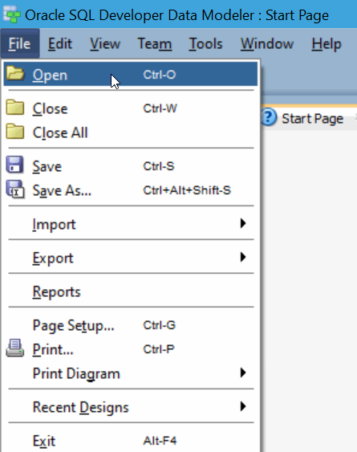

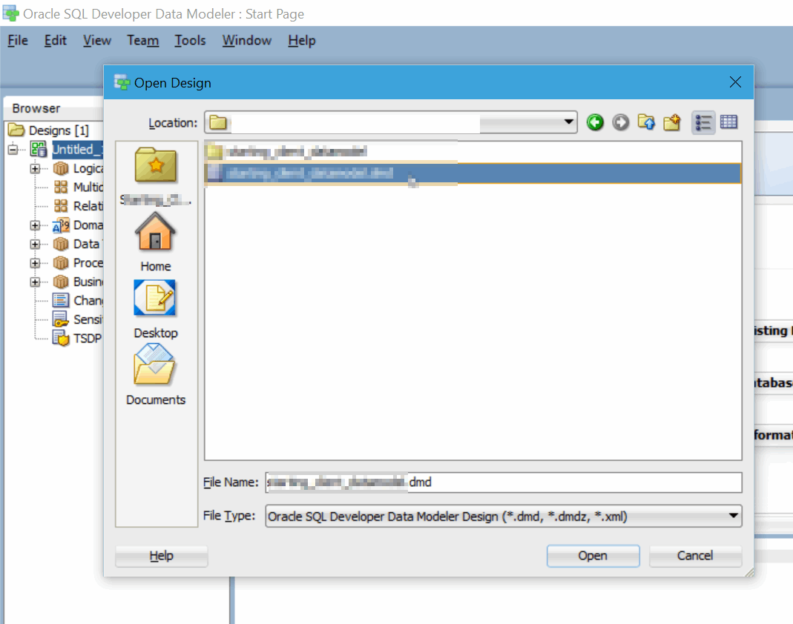

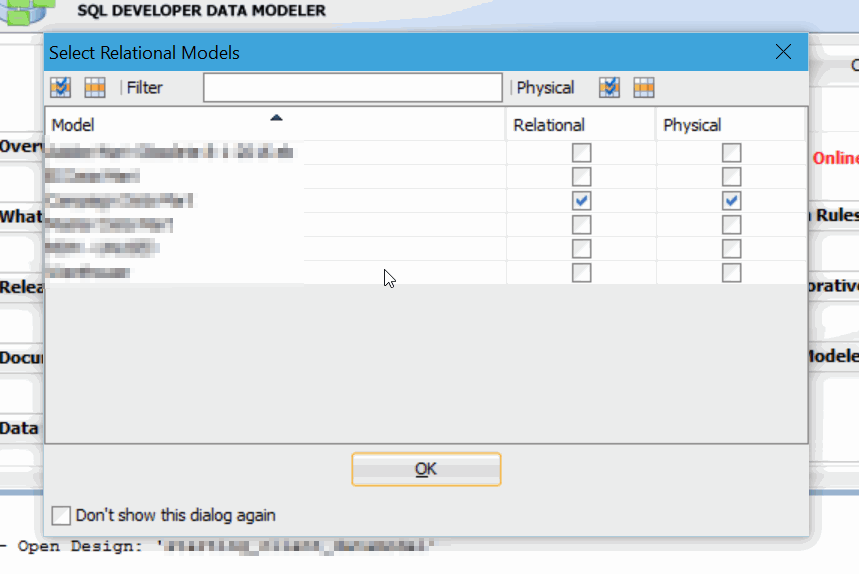

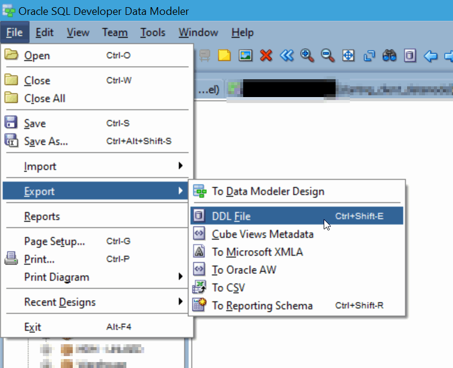

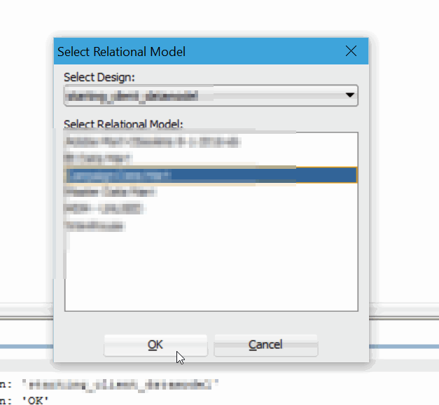


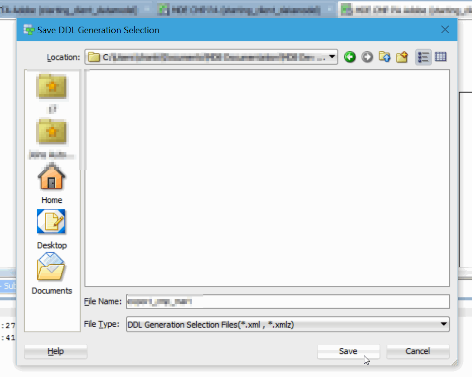

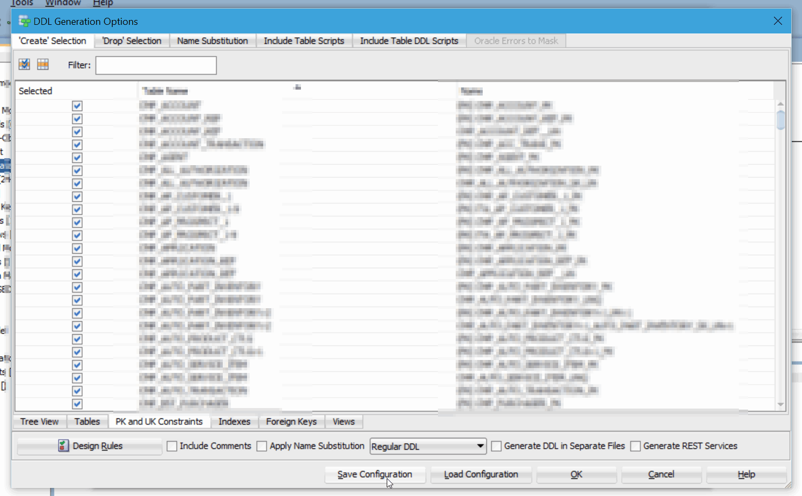


The following object types are required (each has their own tab, make sure they are checked in the export).
  -  PK and UK Constraints
  -  Indexes
  -  Foreign Keys


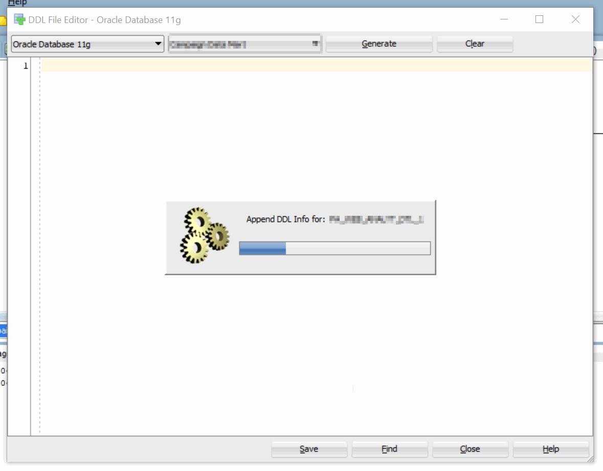

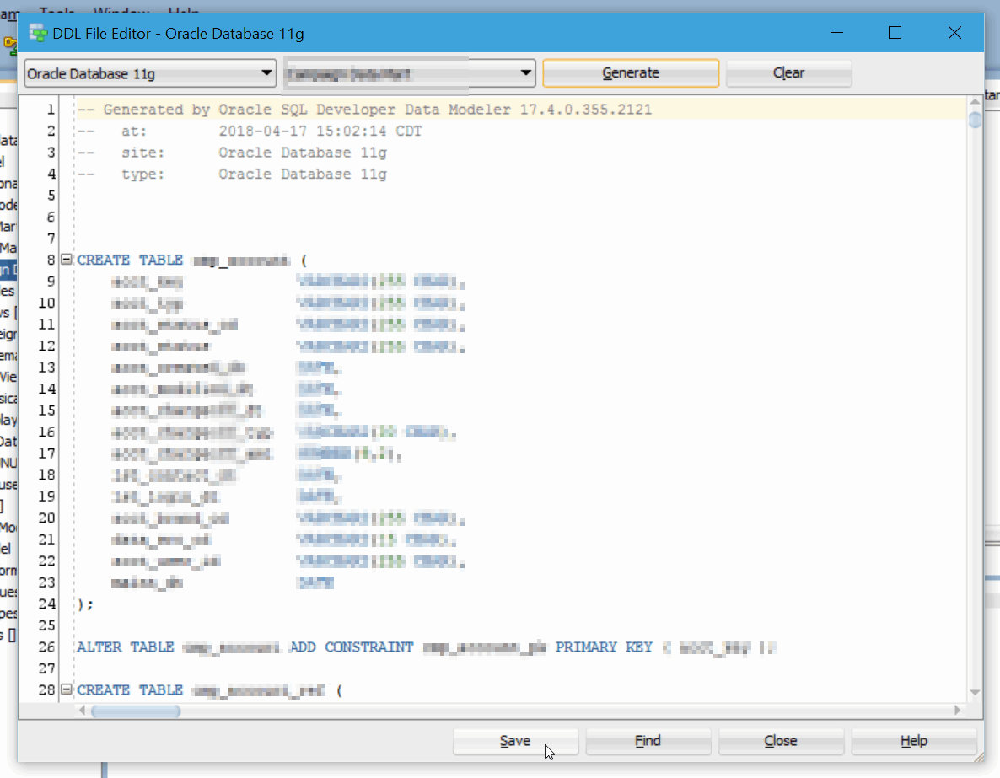

Sanity check the generated SQL code, insure that it has all the required DDL statements mentioned above.

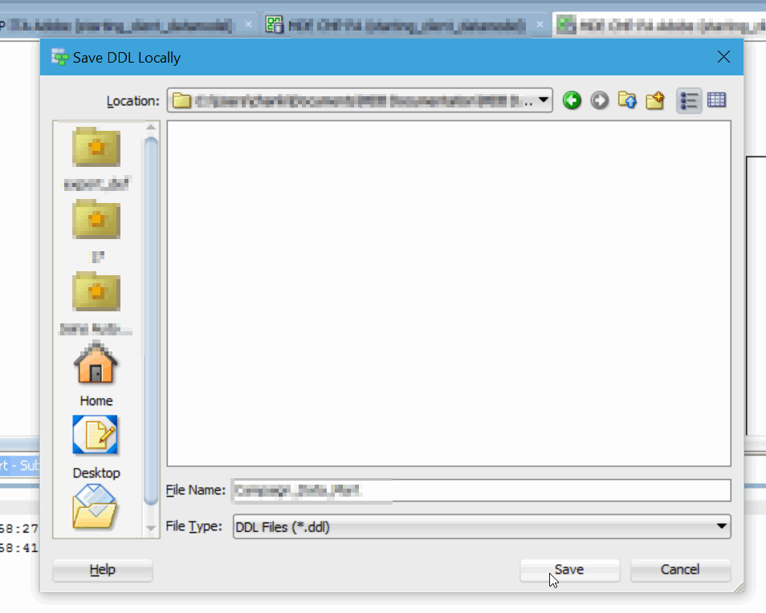

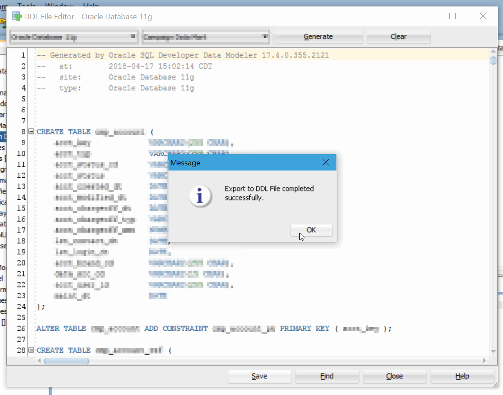

Save the generated DDL file somewhere that the join-hero utility can read it.

